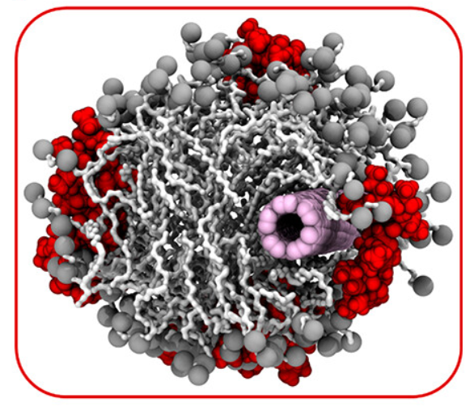

# Welcome  👋

 
Machine Learning and Molecular Dynamic Simulation of Bio-Molecular and Polymeric Systems.

Checkout my website for a list of all [publications :books:](https://payamkelich.github.io/publications.html), or my[Google Scholar :mortar_board:](https://scholar.google.com/citations?user=JyGB2-MAAAAJ&hl=en)

<!--
**payamkelich/payamkelich** is a ✨ _special_ ✨ repository because its `README.md` (this file) appears on your GitHub profile.

Here are some ideas to get you started:

- 🔭 I’m currently working on ...
- 🌱 I’m currently learning ...
- 👯 I’m looking to collaborate on ...
- 🤔 I’m looking for help with ...
- 💬 Ask me about ...
- 📫 How to reach me: ...
- 😄 Pronouns: ...
- ⚡ Fun fact: ...
-->
